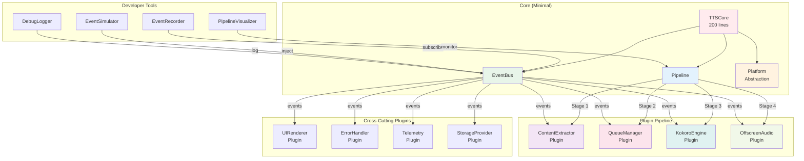

# Section 5: Component Architecture (Redesigned as Plugins)

## Core Components (Minimal)

### TTSCore Component
**Responsibility:** Event bus and pipeline orchestration, performance monitoring
**Size:** Right-sized for robustness (not artificially constrained)
**Integration:** Central hub that all plugins connect to

```javascript
class TTSCore {
  constructor() {
    this.eventBus = new EventBus();
    this.pipeline = new Pipeline();
    this.plugins = new Map();
    this.pal = new PlatformAbstractionLayer();
  }

  async init() {
    // Load and initialize all plugins
    const pluginManifest = await this.pal.storage.get('plugins');
    for (const config of pluginManifest) {
      await this.loadPlugin(config);
    }
  }

  async loadPlugin(config) {
    const plugin = await import(config.path);
    plugin.init(this.eventBus, this.pal);
    this.plugins.set(plugin.id, plugin);
    this.pipeline.register(plugin.stage, plugin);
  }

  async process(event) {
    return this.pipeline.execute(event);
  }
}
```

## Plugin Components

### ContentExtractor Plugin
**Responsibility:** Extract text from web pages
**Owner:** Single developer
**API Version:** 1.0
**Stage:** Extraction

**Stable API Contract:**
```javascript
interface ContentExtractor {
  // Main extraction method
  extract(options: {
    mode: 'selection' | 'article' | 'full' | 'custom',
    selector?: string,
    filters?: ExtractorFilter[],
    includeImages?: boolean,
    includeLinks?: boolean,
    preserveFormatting?: boolean
  }): Promise<ExtractedContent>;

  // Readability.js wrapper
  extractArticle(document: Document): ArticleContent;

  // Custom extraction rules
  addRule(domain: string, rule: ExtractionRule): void;

  // Get extraction capabilities
  getCapabilities(): ExtractorCapabilities;
}
```

**Implementation:**
```javascript
class ContentExtractorPlugin {
  constructor() {
    this.id = 'content-extractor';
    this.stage = 'extraction';
    this.version = '1.0.0';
  }

  init(eventBus, pal) {
    this.eventBus = eventBus;
    this.pal = pal;
    this.readability = new Readability();
  }

  async process(event) {
    if (event.source.type === 'selection') {
      event.input.text = await this.extractSelection();
    } else if (event.source.type === 'page') {
      event.input.text = await this.extractArticle(document);
    }
    return event;
  }
}
```

### KokoroEngine Plugin
**Responsibility:** TTS synthesis using Kokoro model
**Owner:** Single developer
**API Version:** 1.0
**Stage:** Synthesis

**Stable API Contract:**
```javascript
interface KokoroEngine {
  // Core synthesis - implements full SynthesisEngine interface
  synthesize(options: SynthesisOptions): Promise<AudioResult>;

  // Voice management
  listVoices(): KokoroVoice[];
  setVoice(voiceId: string): void;

  // Model management
  loadModel(): Promise<void>;
  unloadModel(): void;
  getModelStatus(): ModelStatus;

  // Performance tuning
  setQuality(quality: 'draft' | 'normal' | 'high'): void;
  setBatchSize(size: number): void;
}
```

**Implementation:**
```javascript
class KokoroEnginePlugin {
  constructor() {
    this.id = 'kokoro-engine';
    this.stage = 'synthesis';
    this.version = '1.0.0';
    // Preserve existing Kokoro.js code
    this.kokoro = null;
  }

  async init(eventBus, pal) {
    this.eventBus = eventBus;
    this.pal = pal;
    await this.loadModel();
  }

  async process(event) {
    const audio = await this.synthesize({
      text: event.input.text,
      voice: event.input.voice || 'af_bella',
      speed: event.input.speed || 1.0
    });
    event.output.audio = audio.buffer;
    event.output.duration = audio.duration;
    return event;
  }
}
```

### OffscreenAudio Plugin
**Responsibility:** Audio playback management via Offscreen API
**Owner:** Single developer
**API Version:** 1.0
**Stage:** Playback

**Stable API Contract:**
```javascript
interface OffscreenAudio {
  // Audio playback control
  play(audio: AudioBuffer, options?: PlaybackOptions): Promise<void>;
  pause(): void;
  resume(): void;
  stop(): void;

  // Stream management
  streamChunk(chunk: AudioChunk): Promise<void>;
  flushStream(): Promise<void>;

  // State management
  getPlaybackState(): PlaybackState;
  setVolume(volume: number): void;
  setSpeed(speed: number): void;

  // Lifecycle
  recycle(): Promise<void>;
}
```

### UIRenderer Plugin
**Responsibility:** Render all UI components with Shadow DOM isolation
**Owner:** Single developer
**API Version:** 1.0
**Stage:** UI (parallel to pipeline)

**Stable API Contract:**
```javascript
interface UIRenderer {
  // Component rendering with future-proof options
  renderButton(options: {
    position: Position,
    theme?: Theme,
    size?: Size,
    animation?: Animation,
    accessibility?: A11yOptions
  }): ShadowRoot;

  renderProgress(options: {
    value: number,
    style?: ProgressStyle,
    showTime?: boolean,
    showPercentage?: boolean
  }): void;

  // Theme management (future)
  setTheme(theme: Theme): void;
  getAvailableThemes(): Theme[];

  // Accessibility (future)
  announceToScreenReader(message: string): void;
  setHighContrastMode(enabled: boolean): void;
}
```

### QueueManager Plugin
**Responsibility:** Manage TTS request queue with prioritization
**Owner:** Single developer
**API Version:** 1.0
**Stage:** Queue

**Stable API Contract:**
```javascript
interface QueueManager {
  // Queue operations
  enqueue(event: SynthesisEvent, priority?: Priority): Promise<void>;
  dequeue(): SynthesisEvent | null;
  peek(): SynthesisEvent | null;
  clear(): void;

  // Priority management
  setPriority(eventId: string, priority: Priority): void;

  // Rate limiting
  setRateLimit(requestsPerSecond: number): void;

  // Queue state
  getQueueLength(): number;
  getQueueState(): QueueState;

  // Future: Batch processing
  enqueueBatch(events: SynthesisEvent[]): Promise<void>;
  processBatch(size: number): SynthesisEvent[];
}
```

### ErrorHandler Plugin
**Responsibility:** Centralized error handling and recovery
**Owner:** Single developer
**API Version:** 1.0
**Stage:** Cross-cutting (all stages)

**Stable API Contract:**
```javascript
interface ErrorHandler {
  // Error handling
  handleError(error: Error, context: ErrorContext): void;

  // Recovery strategies
  setRecoveryStrategy(errorType: string, strategy: RecoveryStrategy): void;
  attemptRecovery(error: Error): Promise<boolean>;

  // Circuit breaker
  tripCircuit(componentId: string): void;
  resetCircuit(componentId: string): void;
  isCircuitOpen(componentId: string): boolean;

  // Error reporting
  getErrorLog(): ErrorLogEntry[];
  clearErrorLog(): void;

  // User notifications
  notifyUser(message: string, severity: Severity): void;
}
```

## Component Interaction Diagram


